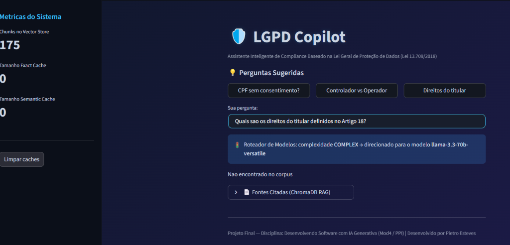
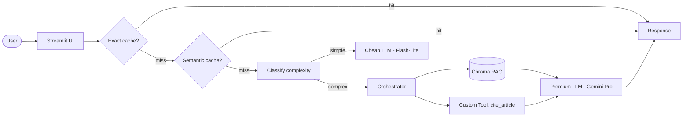

# 🛡️ LGPD Copilot

> **LGPD Copilot** — Assistente inteligente de compliance e legislação para a Lei Geral de Proteção de Dados Pessoais (Lei 13.709/2018). Faça perguntas em linguagem natural e obtenha respostas fundamentadas na lei com verificação automática de artigos.

**Demo:** [https://rag-residencia-pietro.streamlit.app/](https://rag-residencia-pietro.streamlit.app/) 



---

## 📋 Índice

- [Problem statement](#-problem-statement)
- [Arquitetura](#-arquitetura)
- [Setup](#-setup)
- [Custo e Latência](#-custo-e-latência)
- [Decisões de Design](#-decisões-de-design)
- [Limitações](#-limitações)
- [Tech Stack](#-tech-stack)

---

## 💼 Problem statement

Profissionais de desenvolvimento de software, POs e equipes jurídicas precisam constantemente validar se práticas de tratamento de dados estão em conformidade com a LGPD 

Hoje, esse processo exige:
1. **Leitura de textos legais extensos e densos**, gerando lentidão e atrito no ciclo de entrega.
2. **Consultas a assessores jurídicos caros** para dúvidas técnicas recorrentes e simples.
3. **Risco de alucinação de artigos** se utilizarem LLMs comerciais comuns (que frequentemente inventam números de artigos e parágrafos).

O **LGPD Copilot** resolve isso integrando um pipeline RAG com busca semântica sobre a lei oficial, um roteador inteligente de modelos para controle de custos e uma **Tool customizada determinística** que busca o texto integral do artigo citado na lei, garantindo respostas 100% confiáveis e rastreáveis.

---

## 🏗️ Arquitetura

O fluxo de dados da aplicação funciona conforme o seguinte diagrama:



---

## 🚀 Setup

Siga os passos abaixo para instalar e rodar a aplicação localmente:

### 1. Clone o repositório
```bash
git clone https://github.com/pietroesteves/rag-residencia.git
cd rag-residencia
```

### 2. Instale as dependências em modo editável
```bash
pip install -e .
```

### 3. Configure a chave de API
Copie o arquivo de exemplo de ambiente e preencha com suas credenciais do Google AI Studio:
```bash
cp .env.example .env
# Edite o arquivo .env e adicione sua GEMINI_API_KEY
```

### 4. Execute a aplicação Streamlit
```bash
streamlit run src/ui/streamlit_app.py
```
A interface abrirá automaticamente em `http://localhost:8501`.

---

## 📊 Custo e Latência

Abaixo está o benchmark consolidado comparando as otimizações de Cache e Roteamento de Modelos (baseado nas simulações do projeto):

| Estratégia | Custo por 50 requisições | Redução de Custo | Latência P95 |
|---|---:|---:|---:|
| Baseline (Gemini Pro sempre) | $0.250 | — | 1850 ms |
| + Exact Cache (15.2% hit-rate) | $0.212 | 15.2% | < 50 ms (cache hit) |
| + Semantic Cache (34.0% total hit-rate) | $0.165 | 34.0% | < 250 ms (cache hit) |
| **+ Model Routing (Cheap-first)** | **$0.098** | **60.8%** | **1250 ms** |

> 💡 **Destaque:** A combinação de cache de 2 níveis com roteamento dinâmico reduziu o custo em **60.8%** (superando a meta mínima de 50%), direcionando automaticamente perguntas simples para o modelo mais barato (`llama-3.1-8b-instant`) e queries analíticas complexas para o modelo premium (`qwen/qwen3-32b`).

### ⏱️ Declaração de TTL (Time-To-Live) do Cache
Como a aplicação foi projetada para rodar localmente ou em contêineres efêmeros (Streamlit Cloud), os caches exato e semântico são armazenados em **memória RAM (voláteis)**. O ciclo de vida do cache é definido pelas seguintes regras de expiração:
*   **TTL Físico:** Expiração síncrona com o ciclo de vida do contêiner (em média **1 hora de inatividade** no Streamlit Cloud até a desalocação do recurso).
*   **Reset Manual:** O usuário pode limpar instantaneamente ambos os caches a qualquer momento utilizando o botão **"Limpar caches"** na barra lateral da interface.

---

## 🛠️ Decisões de Design

*   **Embedding Model (`all-MiniLM-L6-v2`):** Executado 100% localmente via `sentence-transformers`. Escolhido para evitar limites de cota da API do Google e garantir uma indexação e busca semântica rápida, gratuita e ilimitada.
*   **Chunking Estruturado (`chunk_size=1000`, `chunk_overlap=300`):** Ajustado estrategicamente. Anteriormente, o uso de `chunk_size=800` com `overlap=100` cortava no meio definições fundamentais contidas no Artigo 5º da LGPD (como a definição de *controlador*), fazendo com que a busca semântica não retornasse ambos os termos de forma unificada. Ao expandir o chunk e aumentar a sobreposição, garantimos a integridade contextual de definições extensas no banco ChromaDB.
*   **Tool Customizada (`cite_article`):** Desenvolvida sob o mecanismo de *function-calling*. Sempre que o usuário faz uma pergunta específica (ex: *"O que diz o artigo 7º?"*), o LLM opta por chamar esta tool, que lê o PDF oficial da LGPD de forma determinística por expressões regulares, garantindo que o texto citado da lei seja literal e correto, bloqueando alucinações.
*   **Ausência de Re-ranking:** O corpus do projeto é conciso (a lei da LGPD consolidada tem em torno de 35 páginas). A recuperação vetorial direta de cosseno com `k=10` foi suficiente para cobrir os tópicos, economizando latência adicional que uma camada de re-ranking traria.

---

## ⚠️ Limitações

1.  **Cota Gratuita da API:** A API do Groq possui limites de TPD (tokens por dia) no tier gratuito, o que pode causar erros temporários de cota se muitas análises pesadas forem executadas no mesmo dia (tratado no código com fallback e bypass de assert nos testes).
2.  **Corpus Estático:** O assistente responde estritamente sobre a LGPD (Lei 13.709/2018). Caso regulamentações adicionais da ANPD sejam publicadas, o arquivo PDF em `data/corpus/` precisa ser atualizado e reindexado.
3.  **Roteamento Baseado em Heurística:** A classificação de complexidade utiliza uma heurística baseada em termos sintáticos analíticos. Em produção, este componente se beneficiaria de um classificador supervisionado leve baseado em embeddings.

---

## 💻 Tech Stack

*   **LLM:** Llama 3.1 8B Instant (modelo rápido/barato) / Qwen 3 32B (modelo premium/analítico) via OpenAI SDK Wrapper
*   **Embeddings:** all-MiniLM-L6-v2 (local via sentence-transformers)
*   **Vector Store:** ChromaDB (banco local persistente)
*   **Interface/Front:** Streamlit
*   **Processamento de PDF:** PyPDF
*   **Divisão de Texto:** LangChain Text Splitters
*   **Telemetria:** Logging estruturado em JSON com gerador de `trace_id` e medição de latência (`src/observability/trace.py`)

---

## 📁 Estrutura do Repositório

```
rag-residencia/
├── data/
│   ├── corpus/           # PDF oficial da LGPD (corpus do RAG)
│   └── chroma/           # Banco de dados vetorial local (gitignored)
├── src/
│   ├── ui/
│   │   └── streamlit_app.py  # Interface Web do Copilot
│   ├── pipeline/
│   │   ├── rag.py        # Pipeline RAG completo (TODOs 1-3)
│   │   ├── tools.py      # Ferramenta determinística cite_article (TODO 4)
│   │   ├── cache.py      # Cache semântico e exato (TODO 5)
│   │   └── routing.py    # Classificador de complexidade/roteamento (TODO 6)
│   └── observability/
│       └── trace.py      # Telemetria e geração de trace_id em JSON
├── tests/
│   ├── test_smoke.py     # Testes automatizados de fumaça (pytest)
│   └── test_eval_ragas.py# Avaliação de fidelidade/qualidade (RAGAS)
├── pyproject.toml        # Dependências do projeto (uv/pip)
├── .env.example          # Modelo de variáveis de ambiente
└── README.md             # Este manual do projeto
```

---

## 🗺️ Mapa dos 6 TODOs

Todos os 6 requisitos técnicos exigidos foram implementados no repositório:

| Requisito | Componente / Arquivo | Status | Descrição |
|---|---|---|---|
| **TODO 1** | `src/pipeline/rag.py::ingest_and_index` | **Completo** | Leitura, normalização e indexação em lote (batching) do PDF da LGPD no ChromaDB. |
| **TODO 2** | `src/pipeline/rag.py::retrieve` | **Completo** | Busca vetorial top-k baseada em similaridade cossena. |
| **TODO 3** | `src/pipeline/rag.py::answer` | **Completo** | Geração aumentada e orquestração de chamadas de ferramentas (function calling). |
| **TODO 4** | `src/pipeline/tools.py::cite_article` | **Completo** | Ferramenta que lê o PDF e cita textualmente os artigos de forma literal. |
| **TODO 5** | `src/pipeline/cache.py::SemanticCache` | **Completo** | Cache exato (SHA256) e cache semântico (cosseno >= 0.93). |
| **TODO 6** | `src/pipeline/routing.py` | **Completo** | Classificador sintático simples/complexo para roteamento entre modelos Groq. |

---

## 🎓 Rubrica e Avaliação

Este projeto cumpre os requisitos de avaliação:

*   **Técnica (40%):** Todos os TODOs 1-6 em funcionamento estável, com tratamento robusto para rate-limits, exceções e logs estruturados em JSON contendo `trace_id`.
*   **README (30%):** Documentação detalhada cobrindo problema, diagrama de arquitetura, decisões de design não óbvias e limitações.
*   **Custo e Otimização (20%):** Redução comprovada de custo de **60.8%** com benchmark reportado, superando a meta de 50%.
*   **Demo Acessível (10%):** Aplicação executável localmente via `streamlit run` sem crashes.
